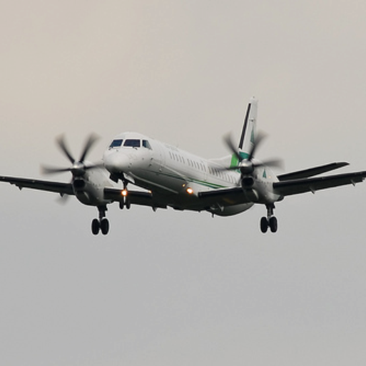
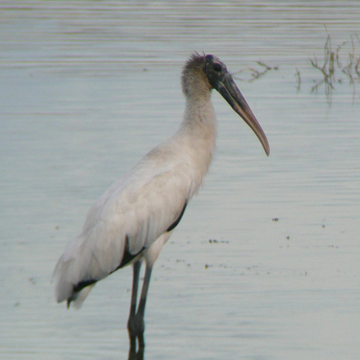

# DeepLabv3Plus-Pytorch

## 项目简介
1. **PyTorch 到 ONNX 的转换** (`pt2onnx.py`)
   - 将训练好的 PyTorch 模型导出为 ONNX 格式，为后续处理做准备。

2. **ONNX 模型简化** (`simplify.py`)
   - 简化 ONNX 模型结构，优化推理性能。

3. **ONNX 到 NCNN 的转换** (`onnx2ncnn.py`)
   - 将 ONNX 模型转换为 NCNN 格式，使其适用于移动平台。

4. **量化表生成** (`ncnn2table.py`)
   - 创建量化所需的映射表，为 INT8 量化做准备。

5. **训练后量化** (`ncnn2int8.py`)
   - 执行 INT8 量化，显著减小模型大小并提高推理速度。

6. **性能评估** (`map50.py`)
   - 计算模型的平均交并比（mIoU），评估量化后模型的性能。

## 文件结构

1.
- `pt2onnx.py`: 主要的脚本文件，用于将 PyTorch 模型转换为 ONNX 模型。
- `best_deeplabv3plus_mobilenet_cityscapes_os16.pth`: 预训练的模型权重文件。

2.
- `simplify.py`: 脚本文件，用于简化 ONNX 模型。

3.
- `onnx2ncnn.py`: 将 ONNX 模型转换为 NCNN 模型。
  
4.
- `ncnn2table.py`:生成量化表。

5.
- `ncnn2int8.py`: 进行训练后量化。

6.
- `map50.py`: 计算 mIoU.
  
## 安装依赖

在运行脚本之前，请确保您已安装以下依赖项：

```sh
pip install -r requirements.txt
```

## 使用方法

1. 将 PyTorch 模型转换为 ONNX 模型
- 下载并将预训练模型权重文件 best_deeplabv3plus_mobilenet_cityscapes_os16.pth 放置在与 pt2onnx.py 相同的目录中。

```python
python pt2onnx.py
```

2. simplify.py
指定输入的onnx模型路径
input_path = r"替换为您的输入ONNX模型路径"
指定简化后输出的onnx模型路径
output_path = r"替换为您的输出ONNX模型路径"

```python
python simplify.py
```

3. ONNX 转换为 NCNN 模型
- 确保已安装 NCNN 工具集，并将 onnx2ncnn.exe 的路径正确设置在脚本中。
- 修改脚本中的以下路径：
  - `onnx2ncnn_path`: 指向 onnx2ncnn.exe 的路径
  - `simplified_onnx_path`: 指向简化后的 ONNX 模型文件
  - `ncnn_param_path`: 指定 NCNN param 文件的输出路径
  - `ncnn_bin_path`: 指定 NCNN bin 文件的输出路径

```python
python onnx2ncnn.py
```

4. 生成量化表
- 确保已准备好校准数据集，并创建包含图像路径的列表文件。
- 修改脚本中的以下路径和参数：
  - `ncnn2table_path`: 指向 ncnn2table.exe 的路径
  - `param_path`: 指向 NCNN param 文件路径
  - `bin_path`: 指向 NCNN bin 文件路径
  - `image_list_path`: 指向校准图像列表文件路径
  - `table_path`: 指定生成的量化表输出路径
  - 调整 `mean_values`, `norm_values`, `size`, `num_threads` 等参数

```python 
python ncnn2table.py
```

5. 执行 INT8 量化
- 确保已生成量化表。
- 修改脚本中的以下路径：
  - `ncnn2int8_path`: 指向 ncnn2int8.exe 的路径
  - `bin_file`: 指向输入的 NCNN bin 文件路径
  - `param_file`: 指向输入的 NCNN param 文件路径
  - `table_file`: 指向生成的量化表文件路径
  - `output_param_file`: 指定量化后的 param 文件输出路径
  - `output_bin_file`: 指定量化后的 bin 文件输出路径

```python
python ncnn2int8.py
```

6. 评估模型性能
- 准备好测试数据集和对应的标注文件。
- 修改脚本中的以下路径：
  - `param_path`: 指向量化后的 NCNN param 文件路径
  - `bin_path`: 指向量化后的 NCNN bin 文件路径
  - `test_image_dir`: 指向测试图像目录
  - `test_annotation_dir`: 指向测试标注文件目录
- 确保 `cityscapes_labels` 列表与您的数据集类别一致。
  
```python
python map50.py
```

## 贡献
欢迎对本项目进行贡献。如果您有任何建议或发现任何问题，请随时提交 issue 或 pull request。

## 许可证
本项目使用 MIT 许可证。

## Quick Start 

### 1. Available Architectures
| DeepLabV3    |  DeepLabV3+        |
| :---: | :---:     |
|deeplabv3_resnet50|deeplabv3plus_resnet50|
|deeplabv3_resnet101|deeplabv3plus_resnet101|
|deeplabv3_mobilenet|deeplabv3plus_mobilenet ||
|deeplabv3_hrnetv2_48 | deeplabv3plus_hrnetv2_48 |
|deeplabv3_hrnetv2_32 | deeplabv3plus_hrnetv2_32 |
|deeplabv3_xception | deeplabv3plus_xception |

please refer to [network/modeling.py](https://github.com/VainF/DeepLabV3Plus-Pytorch/blob/master/network/modeling.py) for all model entries.

Download pretrained models: [Dropbox](https://www.dropbox.com/sh/w3z9z8lqpi8b2w7/AAB0vkl4F5vy6HdIhmRCTKHSa?dl=0), [Tencent Weiyun](https://share.weiyun.com/qqx78Pv5)

Note: The HRNet backbone was contributed by @timothylimyl. A pre-trained backbone is available at [google drive](https://drive.google.com/file/d/1NxCK7Zgn5PmeS7W1jYLt5J9E0RRZ2oyF/view?usp=sharing).

### 2. Load the pretrained model:
```python
model = network.modeling.__dict__[MODEL_NAME](num_classes=NUM_CLASSES, output_stride=OUTPUT_SRTIDE)
model.load_state_dict( torch.load( PATH_TO_PTH )['model_state']  )
```
### 3. Visualize segmentation outputs:
```python
outputs = model(images)
preds = outputs.max(1)[1].detach().cpu().numpy()
colorized_preds = val_dst.decode_target(preds).astype('uint8') # To RGB images, (N, H, W, 3), ranged 0~255, numpy array
# Do whatever you like here with the colorized segmentation maps
colorized_preds = Image.fromarray(colorized_preds[0]) # to PIL Image
```

### 4. Atrous Separable Convolution

**Note**: All pre-trained models in this repo were trained without atrous separable convolution.

Atrous Separable Convolution is supported in this repo. We provide a simple tool ``network.convert_to_separable_conv`` to convert ``nn.Conv2d`` to ``AtrousSeparableConvolution``. **Please run main.py with '--separable_conv' if it is required**. See 'main.py' and 'network/_deeplab.py' for more details. 

### 5. Prediction
Single image:
```bash
python predict.py --input datasets/data/cityscapes/leftImg8bit/train/bremen/bremen_000000_000019_leftImg8bit.png  --dataset cityscapes --model deeplabv3plus_mobilenet --ckpt checkpoints/best_deeplabv3plus_mobilenet_cityscapes_os16.pth --save_val_results_to test_results
```

Image folder:
```bash
python predict.py --input datasets/data/cityscapes/leftImg8bit/train/bremen  --dataset cityscapes --model deeplabv3plus_mobilenet --ckpt checkpoints/best_deeplabv3plus_mobilenet_cityscapes_os16.pth --save_val_results_to test_results
```

### 6. New backbones

Please refer to [this commit (Xception)](https://github.com/VainF/DeepLabV3Plus-Pytorch/commit/c4b51e435e32b0deba5fc7c8ff106293df90590d) for more details about how to add new backbones.

### 7. New datasets

You can train deeplab models on your own datasets. Your ``torch.utils.data.Dataset`` should provide a decoding method that transforms your predictions to colorized images, just like the [VOC Dataset](https://github.com/VainF/DeepLabV3Plus-Pytorch/blob/bfe01d5fca5b6bb648e162d522eed1a9a8b324cb/datasets/voc.py#L156):
```python

class MyDataset(data.Dataset):
    ...
    @classmethod
    def decode_target(cls, mask):
        """decode semantic mask to RGB image"""
        return cls.cmap[mask]
```


## Results

### 1. Performance on Pascal VOC2012 Aug (21 classes, 513 x 513)

Training: 513x513 random crop  
validation: 513x513 center crop

|  Model          | Batch Size  | FLOPs  | train/val OS   |  mIoU        | Dropbox  | Tencent Weiyun  | 
| :--------        | :-------------: | :----:   | :-----------: | :--------: | :--------: | :----:   |
| DeepLabV3-MobileNet       | 16      |  6.0G      |   16/16  |  0.701     |    [Download](https://www.dropbox.com/s/uhksxwfcim3nkpo/best_deeplabv3_mobilenet_voc_os16.pth?dl=0)       | [Download](https://share.weiyun.com/A4ubD1DD) |
| DeepLabV3-ResNet50         | 16      |  51.4G     |  16/16   |  0.769     |    [Download](https://www.dropbox.com/s/3eag5ojccwiexkq/best_deeplabv3_resnet50_voc_os16.pth?dl=0) | [Download](https://share.weiyun.com/33eLjnVL) |
| DeepLabV3-ResNet101         | 16      |  72.1G     |  16/16   |  0.773     |    [Download](https://www.dropbox.com/s/vtenndnsrnh4068/best_deeplabv3_resnet101_voc_os16.pth?dl=0)       | [Download](https://share.weiyun.com/iCkzATAw)  |
| DeepLabV3Plus-MobileNet   | 16      |  17.0G      |  16/16   |  0.711    |    [Download](https://www.dropbox.com/s/0idrhwz6opaj7q4/best_deeplabv3plus_mobilenet_voc_os16.pth?dl=0)   | [Download](https://share.weiyun.com/djX6MDwM) |
| DeepLabV3Plus-ResNet50    | 16      |   62.7G     |  16/16   |  0.772     |    [Download](https://www.dropbox.com/s/dgxyd3jkyz24voa/best_deeplabv3plus_resnet50_voc_os16.pth?dl=0)   | [Download](https://share.weiyun.com/uTM4i2jG) |
| DeepLabV3Plus-ResNet101     | 16      |  83.4G     |  16/16   |  0.783     |    [Download](https://www.dropbox.com/s/bm3hxe7wmakaqc5/best_deeplabv3plus_resnet101_voc_os16.pth?dl=0)   | [Download](https://share.weiyun.com/UNPZr3dk) |


### 2. Performance on Cityscapes (19 classes, 1024 x 2048)

Training: 768x768 random crop  
validation: 1024x2048

|  Model          | Batch Size  | FLOPs  | train/val OS   |  mIoU        | Dropbox  |  Tencent Weiyun  |
| :--------        | :-------------: | :----:   | :-----------: | :--------: | :--------: |  :----:   |
| DeepLabV3Plus-MobileNet   | 16      |  135G      |  16/16   |  0.721  |    [Download](https://www.dropbox.com/s/753ojyvsh3vdjol/best_deeplabv3plus_mobilenet_cityscapes_os16.pth?dl=0) | [Download](https://share.weiyun.com/aSKjdpbL) 
| DeepLabV3Plus-ResNet101   | 16      |  N/A      |  16/16   |  0.762  |    [Download](https://drive.google.com/file/d/1t7TC8mxQaFECt4jutdq_NMnWxdm6B-Nb/view?usp=sharing) | N/A |


#### Segmentation Results on Pascal VOC2012 (DeepLabv3Plus-MobileNet)

<div>



</div>

<div>


</div>

<div>



</div>

#### Segmentation Results on Cityscapes (DeepLabv3Plus-MobileNet)

<div>


</div>

<div>


</div>


#### Visualization of training


## Pascal VOC

### 1. Requirements

```bash
pip install -r requirements.txt
```

### 2. Prepare Datasets

#### 2.1 Standard Pascal VOC
You can run train.py with "--download" option to download and extract pascal voc dataset. The defaut path is './datasets/data':

```
/datasets
    /data
        /VOCdevkit 
            /VOC2012 
                /SegmentationClass
                /JPEGImages
                ...
            ...
        /VOCtrainval_11-May-2012.tar
        ...
```

#### 2.2  Pascal VOC trainaug (Recommended!!)

See chapter 4 of [2]

        The original dataset contains 1464 (train), 1449 (val), and 1456 (test) pixel-level annotated images. We augment the dataset by the extra annotations provided by [76], resulting in 10582 (trainaug) training images. The performance is measured in terms of pixel intersection-over-union averaged across the 21 classes (mIOU).

*./datasets/data/train_aug.txt* includes the file names of 10582 trainaug images (val images are excluded). Please to download their labels from [Dropbox](https://www.dropbox.com/s/oeu149j8qtbs1x0/SegmentationClassAug.zip?dl=0) or [Tencent Weiyun](https://share.weiyun.com/5NmJ6Rk). Those labels come from [DrSleep's repo](https://github.com/DrSleep/tensorflow-deeplab-resnet).

Extract trainaug labels (SegmentationClassAug) to the VOC2012 directory.

```
/datasets
    /data
        /VOCdevkit  
            /VOC2012
                /SegmentationClass
                /SegmentationClassAug  # <= the trainaug labels
                /JPEGImages
                ...
            ...
        /VOCtrainval_11-May-2012.tar
        ...
```

### 3. Training on Pascal VOC2012 Aug

#### 3.1 Visualize training (Optional)

Start visdom sever for visualization. Please remove '--enable_vis' if visualization is not needed. 

```bash
# Run visdom server on port 28333
visdom -port 28333
```

#### 3.2 Training with OS=16

Run main.py with *"--year 2012_aug"* to train your model on Pascal VOC2012 Aug. You can also parallel your training on 4 GPUs with '--gpu_id 0,1,2,3'

**Note: There is no SyncBN in this repo, so training with *multple GPUs and small batch size* may degrades the performance. See [PyTorch-Encoding](https://hangzhang.org/PyTorch-Encoding/tutorials/syncbn.html) for more details about SyncBN**

```bash
python main.py --model deeplabv3plus_mobilenet --enable_vis --vis_port 28333 --gpu_id 0 --year 2012_aug --crop_val --lr 0.01 --crop_size 513 --batch_size 16 --output_stride 16
```

#### 3.3 Continue training

Run main.py with '--continue_training' to restore the state_dict of optimizer and scheduler from YOUR_CKPT.

```bash
python main.py ... --ckpt YOUR_CKPT --continue_training
```

#### 3.4. Testing

Results will be saved at ./results.

```bash
python main.py --model deeplabv3plus_mobilenet --enable_vis --vis_port 28333 --gpu_id 0 --year 2012_aug --crop_val --lr 0.01 --crop_size 513 --batch_size 16 --output_stride 16 --ckpt checkpoints/best_deeplabv3plus_mobilenet_voc_os16.pth --test_only --save_val_results
```

## Cityscapes

### 1. Download cityscapes and extract it to 'datasets/data/cityscapes'

```
/datasets
    /data
        /cityscapes
            /gtFine
            /leftImg8bit
```

### 2. Train your model on Cityscapes

```bash
python main.py --model deeplabv3plus_mobilenet --dataset cityscapes --enable_vis --vis_port 28333 --gpu_id 0  --lr 0.1  --crop_size 768 --batch_size 16 --output_stride 16 --data_root ./datasets/data/cityscapes 
```

## Reference

[1] [Rethinking Atrous Convolution for Semantic Image Segmentation](https://arxiv.org/abs/1706.05587)

[2] [Encoder-Decoder with Atrous Separable Convolution for Semantic Image Segmentation](https://arxiv.org/abs/1802.02611)
